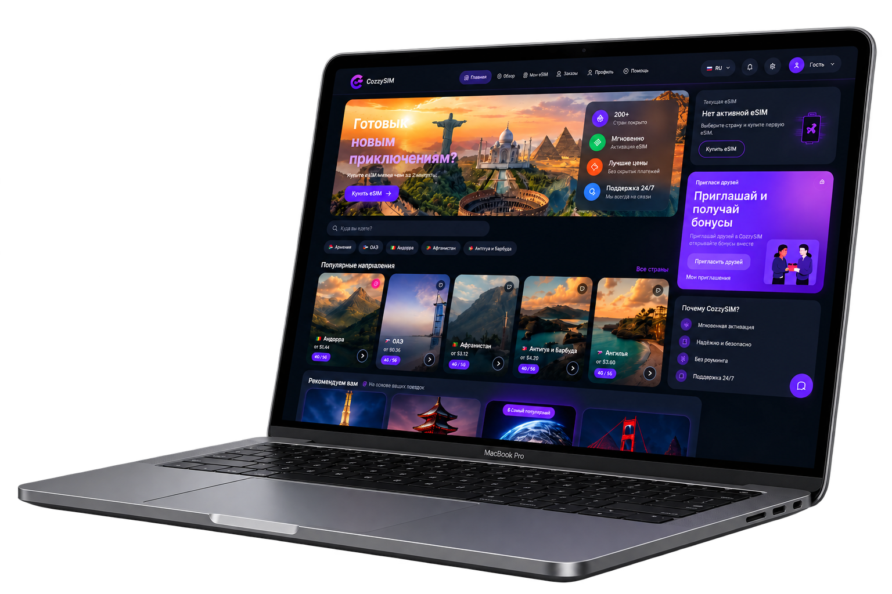
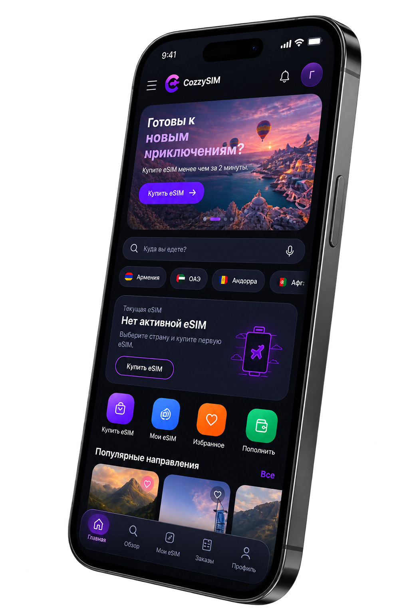

# Hi 👋, I'm Tigran Manukyan

### Senior Backend Developer | NestJS · Node.js · TypeScript · Microservices

[](https://www.linkedin.com/in/tigran-manukyan-348aa822a/)
[](mailto:tigran.manukyan.2002@gmail.com)
[](https://t.me/tig_man21)

---

## 🚀 About Me

I'm a **Senior Backend Developer with 5+ years of professional experience** building production-ready applications, backend systems, SaaS platforms and real-time products.

I specialize in **NestJS, Node.js, TypeScript, PostgreSQL, Redis and microservices architecture**.

I enjoy taking ownership of products end-to-end:

**Architecture → Development → Integrations → Testing → Deployment → Production**

My main areas of expertise:

* ⚙️ **Backend architecture** — scalable and maintainable Node.js/NestJS systems
* 🏗️ **Microservices** — RabbitMQ, TCP RPC and distributed services
* 🔌 **Real-time systems** — WebSocket, Socket.IO and Server-Sent Events
* 💳 **Payments** — Stripe, crypto, TON and Web3 integrations
* 🔐 **Authentication & Security** — JWT, OAuth, 2FA and RBAC
* 📱 **Telegram** — Bots and Telegram Mini Apps
* 🤖 **AI integrations** — AI-powered features and automation
* 🔗 **Third-party APIs** — external services, providers and payment systems
* 🗄️ **Databases** — PostgreSQL, MongoDB and Redis
* 🚀 **Infrastructure** — Docker, Nginx, Linux and production deployments

---

# 🌐 Rcozzy

## CozzySIM — Production eSIM Platform

**CozzySIM** is a production eSIM platform developed under **Rcozzy** for purchasing and managing international mobile connectivity.

The platform combines a modern web application, Telegram Mini App, backend services, Admin CRM, payment flows, eSIM provider integrations and real-time customer support.

<p align="center">
  
  
</p>

### 🚀 What I Built

* 🌍 International eSIM catalog
* 📱 Telegram Mini App
* 🔐 Authentication and user management
* 💳 Payment and transaction flows
* 💰 Balance and wallet management
* 📲 eSIM purchasing and activation
* 🔳 QR-code based eSIM activation
* 🔌 eSIM provider API integrations
* 🧑‍💼 Admin CRM
* 📊 Analytics and management tools
* 💬 Real-time customer support
* 📡 WebSocket communication
* 🤖 AI-powered country content generation
* 🌐 Multilingual interface
* 🌓 Dark / Light themes
* 🔄 Automated backend processes

### 🏗️ Architecture

The platform connects multiple applications and services:

```text
                    ┌──────────────────┐
                    │   Customer Web   │
                    └────────┬─────────┘
                             │
                             │ WebSocket / REST
                             ▼
                    ┌──────────────────┐
                    │     Backend      │
                    │ NestJS / Node.js │
                    └───────┬──────────┘
                            │
              ┌─────────────┼─────────────┐
              │             │             │
              ▼             ▼             ▼
        ┌──────────┐  ┌──────────┐  ┌──────────────┐
        │PostgreSQL│  │  Redis   │  │ eSIM Provider│
        └──────────┘  └──────────┘  └──────────────┘
              │
              ▼
        ┌──────────────┐
        │   Admin CRM  │
        └──────┬───────┘
               │
               ▼
        ┌──────────────┐
        │   Telegram   │
        └──────────────┘
```

### 💬 Real-Time Support

One of the key parts of the platform is the real-time support architecture connecting:

**Customer Web App ↔ Backend ↔ Admin CRM ↔ Telegram**

This allows support agents to communicate with customers across multiple channels from a centralized CRM.

### 🛠️ CozzySIM Stack

`NestJS` `Node.js` `TypeScript` `PostgreSQL` `Redis`

`React` `Next.js` `WebSocket` `Socket.IO`

`Telegram Mini Apps` `Docker` `Nginx`

`REST API` `AI Integrations` `Third-party APIs`

---

# 🛠️ Tech Stack

### Backend


### Frontend


### Data & Infrastructure


### APIs & Integrations


---

# 🌟 Featured Projects

## 🎮 Crash Game — Real-Time Telegram Mini App

Real-time Crash multiplier game built as a Telegram Mini App with TON crypto and NFT-gift betting.

The system uses a microservice architecture consisting of the frontend, game server and bot/blockchain services.

Services communicate through **TCP RPC and RabbitMQ**, while the game itself uses a server-driven WebSocket loop.

### Key technologies

`NestJS` `React` `TypeScript` `Socket.IO`

`PostgreSQL` `Redis` `RabbitMQ` `TON SDK`

`Telegram Mini Apps` `TonAPI` `Telegram Stars`

---

## 🛒 Homeberries — Multi-Tenant E-Commerce Platform

Multi-tenant SaaS marketplace with isolated storefronts for individual companies.

The platform supports flexible payment methods, including Stripe and cryptocurrency, with a modern Next.js storefront.

### Key features

* Multi-tenant architecture
* Isolated company storefronts
* Payment integrations
* Stripe
* Bitcoin / Web3
* 3D product views
* Google Maps delivery integration

### Stack

`NestJS` `Next.js` `React` `PostgreSQL` `RabbitMQ` `Stripe`

---

## 🥩 Ararat Family Meat Co. — B2B Order Management

B2B platform developed to replace spreadsheets and paper-based workflows for a wholesale food distributor.

### Key features

* Weight-based invoicing
* Per-client pricing
* Order management
* Payment tracking
* Automated PDF generation
* Customer management

### Stack

`Next.js` `NestJS` `PostgreSQL` `Sequelize` `Docker`

---

## 📦 Order — Offline-First Warehouse & Delivery App

Mobile-first warehouse and delivery application designed for environments with unreliable internet connectivity.

The application supports offline order queueing, automatic synchronization and business analytics.

### Key features

* Offline-first architecture
* Automatic synchronization
* Order queueing
* Price snapshots
* Revenue analytics
* Profit analytics

### Stack

`React 19` `TypeScript` `Vite`

`TanStack Query` `Zustand`

---

# 📊 Engineering Focus

I particularly enjoy working on systems where architecture and reliability matter:

* High-load backend services
* Distributed systems
* Microservices
* Real-time communication
* Payment infrastructure
* API integrations
* SaaS platforms
* Telegram Mini Apps
* Automation
* AI-powered products
* Production infrastructure

---

# 📫 Get in Touch

* 💼 LinkedIn: `tigran-manukyan-348aa822a`
* ✉️ Email: `tigran.manukyan.2002@gmail.com`
* 💬 Telegram: `@tig_man21`
* 📍 Vanadzor, Armenia

---

### Open to new opportunities

**Senior Backend / Full-Stack Developer — Remote or Hybrid**

I'm available for backend development, full-stack projects, system architecture, API integrations, Telegram Mini Apps and long-term product development.

If you are building a product that needs a reliable backend, scalable architecture or complex integrations, feel free to reach out.
